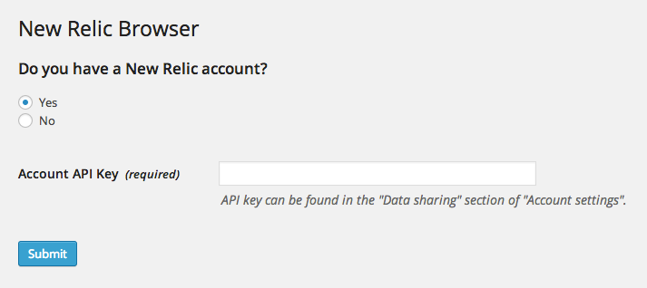
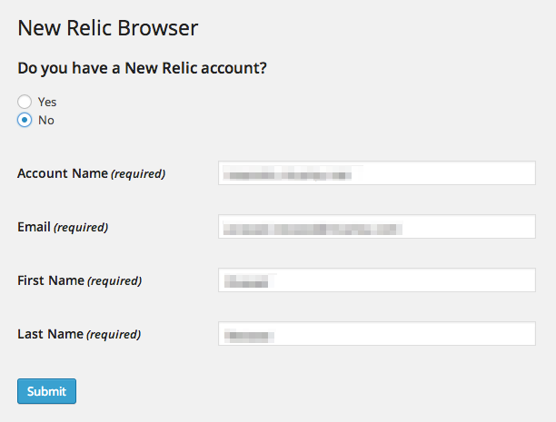
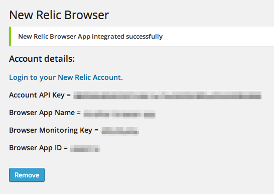

<!-- DO NOT EDIT THIS FILE; it is auto-generated from readme.txt -->
# New Relic Browser

This plugin will allow you to integrate New Relic Browser app in your website.

**Contributors:** [rtcamp](http://profiles.wordpress.org/rtcamp), [newrelic](http://profiles.wordpress.org/newrelic), [prasad-nevase](http://profiles.wordpress.org/prasad-nevase), [rakshit](http://profiles.wordpress.org/rakshit), [rohanveer](http://profiles.wordpress.org/rohanveer)  
**Tags:** [new relic browser for wordpress](http://wordpress.org/plugins/tags/new relic browser for wordpress), [new relic wordpress](http://wordpress.org/plugins/tags/new relic wordpress), [new relic wordpress analytics](http://wordpress.org/plugins/tags/new relic wordpress analytics), [new relic wordpress multisite](http://wordpress.org/plugins/tags/new relic wordpress multisite), [new relic wordpress mu](http://wordpress.org/plugins/tags/new relic wordpress mu)  
**Requires at least:** 3.0.1  
**Tested up to:** 4.1  
**Stable tag:** 1.0  
**License:** [GPLv2 or later](http://www.gnu.org/licenses/gpl-2.0.html)  
**Donate Link:** http://rtcamp.com/donate  

## Description ##

New Relic Browser provides deep visibility and actionable insights into real users experiences on your website.
With standard page load timing (sometimes referred to as real user monitoring or RUM), New Relic measures the overall time to load the entire webpage.
However, New Relic Browser goes beyond RUM to also help you monitor the performance of individual sessions, AJAX requests, and JavaScript errors—extending the monitoring throughout the entire life cycle of the page.

This plugin will allow you to integrate your New Relic Browser app with your website.

If you do not have a New Relic account, then just select "No" and provide the required details.

If you already have a New Relic account, then just select "Yes" and provide your account API key.

Hit "Submit" and the New Relic script will be loaded automatically in <head> tag of your site without any manual effort.

* Allows you to create New Relic Account and Browser App a real quick.
* If you already have New Relic Account then you just have to provide API key of your account and then it will give you options to select existing browser app (if you have any) OR crate a new browser app.
* You do not need to edit your theme's header file manually to copy the New Relic javascript manually. The plugin does this on the fly.
* Compatible with WordPress Multisite.
* Thoroughly tested on top 10 WordPress opensource themes and plugins in WordPress themes/plugins repository.

**Important Links**

* [GitHub](http://github.com/rtcamp/rt-newrelic-browser) - Please mention your wordpress.org username when sending pull requests.

## Installation ##

* Install the plugin from the 'Plugins' section in your dashboard (Go to `Plugins > Add New > Search` and search for 'New Relic Browser by rtCamp').
* Alternatively, you can [download](http://downloads.wordpress.org/plugin/rt-newrelic-browser.zip "Download New Relic Browser by rtCamp") the plugin from the repository. Unzip it and upload it to the plugins folder of your WordPress installation (`wp-content/plugins/` directory of your WordPress installation).
* Activate it through the 'Plugins' section.
* Access the settings page from WordPress backend under `Settings > New Relic Browser`.

## Frequently Asked Questions ##

### What if I do not have New Relic account? ###
You can easily create one using this plugin.

### If I have account, then where do I find API Key? ###
In your New Relic account, go to 'Account settings' from top right menu where your username is shown. Then on the next page, select 'Data sharing' from left menu. Make sure you use 'API Key' and not 'Data access key'.

### What if I accidentally delete the integrated browser app from backend? ###
No worries. You can integrate it again using your API Key.

## Screenshots ##

### Select if you have New Relic account or not.

### If you have New Relic account then select Browser Application as part of next step.

### Enter required details if you do not have New Relic account.

### Screen showing successful App integration with details.

## Changelog ##

### 1.0 ###
* First Public Release

